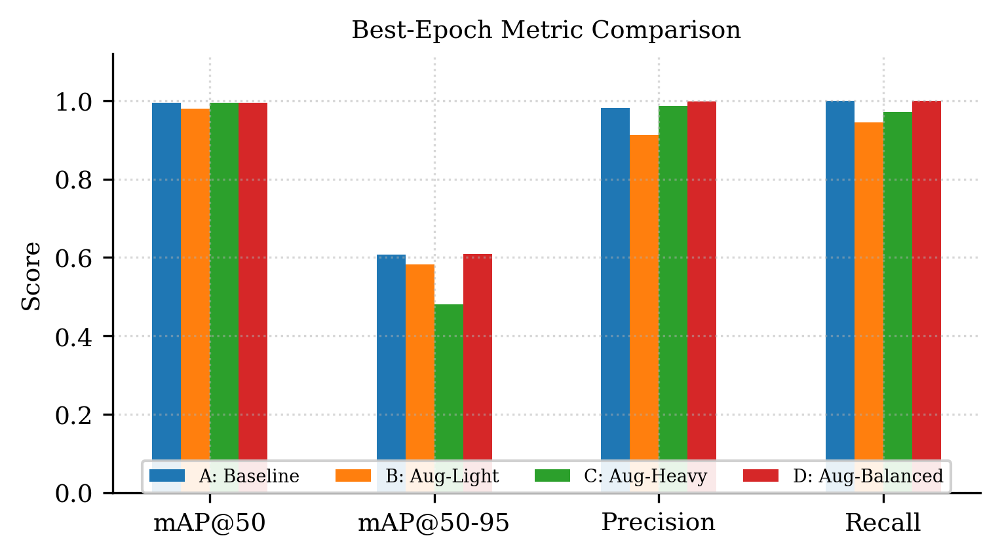

# YOLOv8n Iranian Cheque Detection Augmentation Ablation Study

A controlled ablation study measuring how data augmentation intensity affects YOLOv8n's ability to detect **Iranian bank cheques** under severe data scarcity (177 images). Four training configurations — minimal, light, heavy, and a proposed balanced augmentation recipe — are compared head-to-head under otherwise identical training conditions.

📄 Full writeup: [`paper/cheque_augmentation_ablation.pdf`](paper/cheque_augmentation_ablation.pdf) (IEEE conference format)

> **Scope note:** this model is trained and validated exclusively on Iranian bank cheque imagery — the standardized layout, printed Persian/Farsi fields, and Jalali-calendar date box used by Iranian banks. It is *not* trained on or validated against cheque formats from other countries, and detection accuracy on non-Iranian cheques is unknown.

## Research Question

> Under severe data scarcity, does aggressive augmentation help or hurt a structured-document detector trained on a single, rigid, country-specific cheque layout — and where's the sweet spot?

Augmentation recipes shipped with most detection frameworks (mosaic, copy-paste, mixup, large-angle rotation) were tuned on natural-image datasets with thousands of examples per class. This study tests whether that intensity transfers to a rigid-layout, single-class, ~170-image Iranian cheque detection task.

## Results

| Variant | mAP@50 | mAP@50-95 | Precision | Recall | Best Epoch |
|---|---|---|---|---|---|
| A — Baseline | 0.9950 | 0.6077 | 0.9820 | 1.0000 | 48 |
| B — Aug-Light | 0.9791 | 0.5827 | 0.9136 | 0.9444 | 23 |
| C — Aug-Heavy | 0.9945 | 0.4808 | 0.9866 | 0.9722 | 47 |
| **D — Aug-Balanced** | **0.9950** | **0.6087** | **0.9977** | **1.0000** | 46 |

**Takeaway:** the proposed balanced configuration (moderate mosaic, layout-preserving geometry, light copy-paste, cosine LR) wins on every metric and Pareto-dominates the precision/recall trade-off. Heavy augmentation shows the smallest train/validation generalization gap but the worst mAP@50-95 — augmentation intensity trades optimization difficulty against overfitting resistance even at this small scale. Full discussion in the paper.



## Repository Structure

```
.
├── paper/
│   └── cheque_augmentation_ablation.pdf   # compiled paper
├── figures/
│   ├── fig1_metric_comparison_bar.png
│   ├── fig2_map50_curves.png
│   ├── fig3_map50_95_curves.png
│   ├── fig4_train_loss_curves.png
│   ├── fig5_generalization_gap.png
│   └── fig6_precision_recall_scatter.png
├── models/
│   ├── variant_A_baseline.tflite
│   ├── variant_B_aug_light.tflite
│   ├── variant_C_aug_heavy.tflite
│   ├── variant_D_aug_balanced.tflite
└── README.md

```

## Models

Each variant's trained weights are provided in two formats:

- **`best_float16.tflite`** — float16-quantized TFLite export, for mobile/on-device inference

`variant_D_aug_balanced` is the recommended model for production use based on this study's results.

## Usage


### Python (TFLite / `best_float16.tflite`)

```python
import tensorflow as tf
import numpy as np
from PIL import Image

interpreter = tf.lite.Interpreter(model_path="models/variant_D_aug_balanced/best_float16.tflite")
interpreter.allocate_tensors()
input_details = interpreter.get_input_details()
output_details = interpreter.get_output_details()

image = Image.open("path/to/iranian_cheque.jpg").resize((640, 640))
input_data = (np.array(image, dtype=np.float32) / 255.0)[np.newaxis, ...]

interpreter.set_tensor(input_details[0]["index"], input_data)
interpreter.invoke()
output = interpreter.get_tensor(output_details[0]["index"])  # shape: [1, 5, 8400]

# output[0][4] holds per-anchor confidence scores; output[0][0:4] holds box coords
confidences = output[0][4]
best_idx = np.argmax(confidences)
print(f"Best confidence: {confidences[best_idx]:.4f}")
```

### Flutter / Dart

There are two ways to integrate these models into a Flutter app:

- **Recommended:** use the official [`ultralytics_yolo`](https://pub.dev/packages/ultralytics_yolo) plugin, which handles preprocessing, decoding, and NMS for you on both Android and iOS. See **[FLUTTER_GUIDE.md](FLUTTER_GUIDE.md)** for the full integration walkthrough, including the iOS Core ML export step and an AGPL-3.0 licensing note worth reading before shipping commercially.
- **Manual / dependency-free:** decode the raw TFLite output yourself with `tflite_flutter`, shown below. Use this if you want to avoid the AGPL-3.0 dependency or need full control over postprocessing.

```yaml
# pubspec.yaml
dependencies:
  tflite_flutter: ^0.10.4
  image: ^4.1.7
```

```dart
import 'dart:io';
import 'dart:typed_data';
import 'package:image/image.dart' as img;
import 'package:tflite_flutter/tflite_flutter.dart';

class IranianChequeDetector {
  late Interpreter _interpreter;
  static const int inputSize = 640;
  static const double confThreshold = 0.5;

  Future<void> loadModel() async {
    _interpreter = await Interpreter.fromAsset(
      'assets/models/variant_D_aug_balanced_float16.tflite',
    );
  }

  /// Returns [x1, y1, x2, y2, confidence] in original image coordinates,
  /// or null if no cheque was detected above [confThreshold].
  /// Assumes a single cheque per image (no multi-box NMS needed).
  Future<List<double>?> detectCheque(File imageFile) async {
    final rawImage = img.decodeImage(await imageFile.readAsBytes())!;
    final resized = img.copyResize(rawImage, width: inputSize, height: inputSize);

    final input = Float32List(inputSize * inputSize * 3);
    var idx = 0;
    for (var y = 0; y < inputSize; y++) {
      for (var x = 0; x < inputSize; x++) {
        final pixel = resized.getPixel(x, y);
        input[idx++] = pixel.r / 255.0;
        input[idx++] = pixel.g / 255.0;
        input[idx++] = pixel.b / 255.0;
      }
    }

    // Single-class YOLOv8n export shape: [1, 5, 8400] (4 box coords + 1 confidence)
    final output = List.filled(1 * 5 * 8400, 0.0).reshape([1, 5, 8400]);
    _interpreter.run(input.reshape([1, inputSize, inputSize, 3]), output);

    var bestConf = 0.0;
    var bestIdx = -1;
    for (var i = 0; i < 8400; i++) {
      final conf = output[0][4][i] as double;
      if (conf > bestConf) {
        bestConf = conf;
        bestIdx = i;
      }
    }

    if (bestIdx == -1 || bestConf < confThreshold) return null;

    final cx = (output[0][0][bestIdx] as double) / inputSize * rawImage.width;
    final cy = (output[0][1][bestIdx] as double) / inputSize * rawImage.height;
    final w  = (output[0][2][bestIdx] as double) / inputSize * rawImage.width;
    final h  = (output[0][3][bestIdx] as double) / inputSize * rawImage.height;

    return [cx - w / 2, cy - h / 2, cx + w / 2, cy + h / 2, bestConf];
  }
}
```

> The Flutter example decodes a single best-confidence box, which is sufficient since each image contains exactly one cheque. For multi-object scenes you'd add non-max suppression across all 8400 anchors before picking a result.

## Methodology Summary

All four variants share: YOLOv8n backbone, 120-epoch budget, 640×640 input, batch size 16, seed 42, 80/20 train/val split (141/36 images). Only augmentation parameters and their co-tuned optimization settings (learning rate, weight decay, patience, LR schedule) differ between variants. Full hyperparameter tables and design rationale per variant are in the paper (Section IV).

| | A: Baseline | B: Aug-Light | C: Aug-Heavy | D: Aug-Balanced |
|---|---|---|---|---|
| Mosaic | 0.3 | 0.1 | 1.0 | 0.5 |
| Rotation | 0° | 0° | 15° | 5° |
| Shear / Perspective | — | — | ✓ | — |
| Copy-paste | — | — | 0.2 | 0.1 |
| Mixup | — | — | 0.1 | — |
| LR schedule | constant | constant | constant | cosine |

## Dataset

177 annotated images of Iranian bank cheques, single class (`cheque`). The dataset and resulting model are scoped specifically to the standardized Iranian cheque layout (Persian/Farsi printed fields, Jalali-calendar date box, fixed Central Bank of Iran format) — not a generic, country-agnostic cheque detector. The raw dataset is **not included** in this repository due to the sensitivity of financial document images. Reach out if you have a legitimate research use case.


## Citation

If you use this work, please cite:

```bibtex
@unpublished{cheque_aug_ablation,
  title  = {Augmentation Intensity vs. Generalization in YOLOv8n for Iranian Cheque Detection Under Severe Data Scarcity},
  author = {Mohamadreza Nakhleh},
  year   = {2026},
  note   = {Independent research}
}
```

## License

MIT

## Author

Mohamadreza Nakhleh — Independent Researcher
